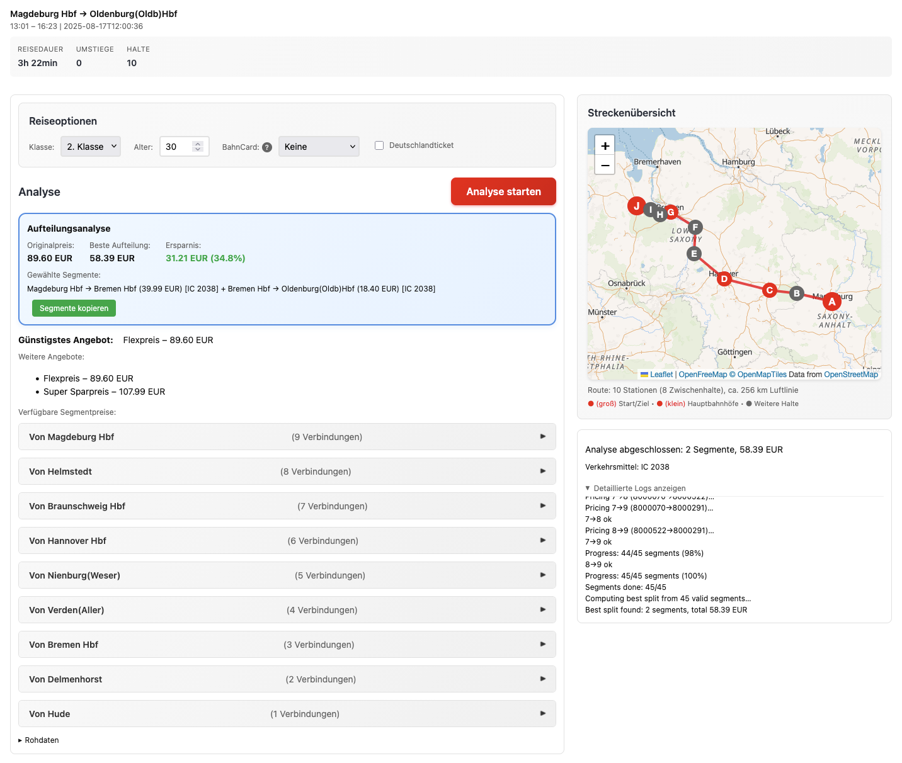

# bahn.deals

A Firefox WebExtension that finds cheaper split-ticket combinations for Deutsche Bahn journeys by analyzing all possible partial segments of your trip.

Very much inspired by [YouTube: Wie ich meine Bahnfart 84% günstiger bekomme (eigene App)](https://www.youtube.com/watch?v=SxKtI8f5QTU).
I felt turning this into a browser extension instead is the most maintainable way forward, since it takes pressure off of anyone hosting this and moves the complexity to the client-side.

## Overview

When booking train tickets on bahn.de, the end-to-end price isn't always the cheapest option. By splitting your journey into multiple segments, you can often save money while taking the exact same trains. This extension automates the process of finding the optimal split-ticket combination.



## Usage

1. Search for a journey on [bahn.de](https://www.bahn.de)
2. Click the 3-dot menu (⋮) on any journey in the search results
3. Select "Günstigste Aufteilung suchen" from the menu
4. Configure your preferences (optional):
   - Travel class (1st/2nd)
   - BahnCard discount
   - Age (affects pricing)
5. Click "Analyse starten" to begin the analysis
6. Book the cheapest possible ticket!

## Installation

### Pre-built

1. Click [here](https://github.com/kiliankoe/bahn.deals/releases) to view releases
2. Download the `bahn-deals-${{ steps.get_tag.outputs.TAG_NAME }}.xpi` from the latest release
3. Navigate to `about:debugging` in Firefox
4. Click "This Firefox" in the sidebar
5. Click "Load Temporary Add-on..."
6. Select the downloaded .xpi file

For permanent installation, the extension will need to be signed by Mozilla. That is not yet the case.

### From Source (Development)

1. Clone this repository:
   ```bash
   git clone https://github.com/kiliankoe/bahn.deals.git
   cd bahn.deals
   ```
2. Open Firefox and navigate to `about:debugging`
3. Click "This Firefox" in the left sidebar
4. Click "Load Temporary Add-on..."
5. Navigate to the `extension` folder and select `manifest.json`

Don't forget to press reload there when changing source files!

## How It Works

The extension uses Deutsche Bahn's internal APIs (via the vendored `db-vendo-client`) to:

1. **Extract Journey Details**: Captures your selected journey including all trains and stops
2. **Generate Segments**: Creates all possible origin-destination pairs along your route
3. **Price Segments**: Queries prices for each segment, ensuring they use the same trains
4. **Optimize**: Uses dynamic programming to find the cheapest combination covering your full journey
5. **Present Results**: Shows the optimal split with clear savings information

## Privacy

- All API calls are made directly from your browser to Deutsche Bahn servers
- No data is sent to third-party servers
- No personal information is stored beyond your configured preferences
- The extension only activates on bahn.de pages

## Known Limitations

- Currently Firefox-only (Chrome support planned)
- Only works with direct Deutsche Bahn tickets (not international or special offers)
- Cannot book tickets directly - provides information for manual booking
- Rate limits may cause slower analysis for very long routes

## Contributing

See [CONTRIBUTING.md](CONTRIBUTING.md) for details.

## Disclaimer

This is an unofficial tool and is not affiliated with Deutsche Bahn. Use at your own discretion. Always verify prices on bahn.de before purchasing tickets.
